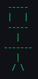
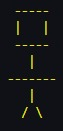
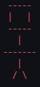

# 🍄 Proyecto: Toad Interactivo 🍄

### ⚠️Aviso importante⚠️
Este programa utiliza la característica de "raw string literals" de C++ para imprimir el texto exactamente como es, incluyendo los caracteres de nueva línea (\n). Asegúrate de tener una versión de C++ que soporte esta característica (C++11 en adelante).

## 🗈 Descripción del Proyecto 🗈

El proyecto "Toad Interactivo" es una aplicación de consola escrita en C++ que permite a los usuarios interactuar con un personaje de "Toad" virtual. Los usuarios pueden interactuar con "Toad" a través de una serie de comandos e instrucciones, lo que lleva a diversas respuestas y acciones de "Toad".

## ⭐ Características ⭐

1. **Interactividad:** Los usuarios pueden interactuar con "Toad" a través de un conjunto de comandos predefinidos (Lea las instrucciones para saber más al respecto).
2. **Respuestas Dinámicas:** "Toad" tiene una variedad de respuestas y acciones basadas en los comandos de los usuarios.
3. **Escrito en C++:** El proyecto está programado en C++, lo que permite una eficiencia de rendimiento y compatibilidad con una variedad de sistemas operativos.

## ❓ Cómo empezar❓

Para iniciar la aplicación, siga los siguientes pasos:

1. Clone el repositorio del proyecto a su sistema local.
2. Compile el proyecto utilizando un compilador C++ compatible.
3. Ejecute el archivo binario generado.

## 💡 Comandos Disponibles 💡

Los comandos para interactuar con "Toad" incluyen, pero no se limitan a, los siguientes:

1. `agacharse`: Hace que "Toad" se agache.
2. `saltar`: Hace que "Toad" salte.
3. `danio`: Le hace 25 puntos de daño a "Toad".
4. `avanzar`: Hace que "Toad" avance.

Se pueden ingresar comandos hasta que "Toad" muera (es decir, su salud llegue a 0).

## 💊 Indicador de vida de Toad 💊
* **100% - 50%:** "Toad" es de color verde.

* **49% - 25%:** "Toad" es de color amarillo.

* **24% - 0%:** "Toad" es de color rojo.
